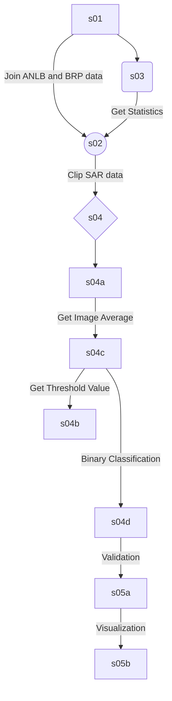

# Precision mapping of inundation

Python script to extract shallow inundation in meadow bird subsidy parcels using Sentinel-1 images from 2021.

The script was commissioned by Wageningen Environmental Research (WENR) - Team Earth Informatics. The script was developed by members of the RGIC23-10 group:

Marnic Baars, Petra Bardocz, Joost van Dalen, Ageeth de Haan, Daan Lichtenberg and Moses Okolo

## Workflow/Order of Execution



## Documentation

The following section outlines what each script does and what modifications users might want to make.

**NOTE:** Calling the `main.py` script runs the entire workflow explained below

### s01_preprocess_vector_data.py

This script

- Filters the ANLb shapefile to 3a-d subsidy parcels and joins them with corresponding BRP parcels.

- Creates a dataset of 1000 randomly sampled BRP parcels which are dry grass only.

**Output Folder(s)**

- _../output_

### s02_preprocess_raster_data.py

This script

- Filters out the central pass S1 backscatter images until August 20 for VV and VH polarisations

- Clips SAR images to the shapefile created in s01, which included the merged ANLb parcels and the 1000 BRP grassland parcels. By default, the scipt clips to mixed pixels, i.e. pixels that lie on the border of parcels are also included.

- Selects the SAR images closest in date to validated water polygon data derived from S2 images.

Optional parts:

- Pure pixel clipping: In case SAR images have to be clipped to only pixels which lie completely within the perimeter of the parcels.

**Output Folder(s)**

- _../output_

### s03_get_anlb_statistics_from_sar.py

This script

- Plots the backscatter timeseries of dry grass parcels, inundated parcels, and 5 representative inundated pixels

(OPTIONAL) TO DO:

The script either runs on the VV or the VH images. Change polarisation in script based on what is needed.

**Output Folder(s)**

- _../output_

### s04a_threshold_image_average.py

This script contains the logic for calculating the average of all the images in an input folder. It employs a moving average of two so for example if your input folder contains four images. An output of two images should be expected where output 1 is the average of images 1 and 2 and output 2 is the average of images 3 and 4.

**NOTE:** The `image_filepaths` variable should be changed to run the script for a different polarization (see comment in script also). All outputs are overwritten for new polarization.

**Output Folder(s)**

- _../data/thresholding_data/output/averages_

### s04b_get_threshold_value.py

This script contains the logic for calculating the optimal threshold value used in the thresholding algorithm. It uses a simple logistic regression model.

**Output Folder(s)**

- _None_

### s04c_thresholding.py

The script takes as input a series of satellite images and applies a threshold to convert them into binary images, where pixels are categorized as either "water" or "non-water" based on their backscatter values.

**NOTE:** The `image_folder` variable should be changed to run the script for a different polarization (see comment in script also). All outputs are overwritten for new polarization.

**Output Folder(s)**

- _../output_
- _../output/running_average_
- _../output/binary_

### s04d_validation.py

This script validates the accuracy of the thresholding algorithm built in `s04c_thresholding.py`.

**Output Folder(s)**

- _../output_

## Visualization

While the following scripts utilise data generated by the main pipeline, they can be run independently.

### s05a_preprocessing_visualisation.py

This script preprocesses the data generated in `s04c_thresholding.py` when ran for VH polarisation and a logistic regression threshold of 0.5. This data is stored separately in `data` > `visualisation`. Also, the joined and filtered ANLb data is preprocessed to be included in the dashboard.

**NOTE:** This script is not part of the pipeline
**Output Folder(s)**

- \_../data/visualisation/

### s05a_visualisation_demo.py

This script runs a demo visualisation using Dash and Plotly. When running, it displays an interactive map with two graphs that update when clicking on the polygons in the map.

**NOTE:** This script is not part of the pipeline
**Input folder(s)**

- \_../data/visualisation/

## Setting up a Virtual Environment on Windows

### 1. Creating a Virtual Environment

First, navigate to your project directory in the Command Prompt:

```bash
cd path\to\your\project\directory
```

Create a new virtual environment inside your project folder. You can replace `env` with the name you'd like to give your virtual environment.

```bash
python -m venv env
```

### 2. Activating the Virtual Environment

Activate the virtual environment using:

```bash
.\env\Scripts\activate
```

Your command prompt should now show the name of your activated environment.

## Installing Required Packages

If you have a `requirements.txt` file in your project, you can install the required packages using:

```bash
pip install -r requirements.txt
```

This will install all the Python dependencies listed in the `requirements.txt` file.

## Running Your Python Script

To run your main Python script (let's say it's called `main.py`), use:

```bash
python main.py
```

You're now set up with a Python virtual environment and are ready to run your Python script!

To deactivate the virtual environment when you're done, just type:

```bash
deactivate
```
